# Cellular Automaton - Game of Life

**A sophisticated JavaFX implementation of Conway's Game of Life with customizable rules and modern dark UI**


 
---

## Overview

This project is a feature-rich implementation of Conway's Game of Life, a zero-player game that simulates cellular evolution based on mathematical rules. The application goes beyond the classic implementation by offering:

- **Custom Rule Configuration**: Support for any cellular automaton rules (not just Conway's 23/3)
- **Interactive Board Editing**: Click and drag to create patterns in real-time
- **Modern Dark UI**: Professional interface with smooth animations and visual feedback
- **Performance Optimized**: Efficient algorithms with toroidal boundary conditions

### Core Specifications

- **Board Dimensions**: 60×40 cells (2400 total cells)
- **Cell Size**: 12px × 12px
- **Update Rate**: Configurable from 0.1x to 5.0x speed
- **Boundary Conditions**: Toroidal (wrap-around edges)
- **Default Rules**: Conway's Game of Life (23/3)

---

## Features

### Core Functionality

| Feature | Description |
|---------|-------------|
| **Real-time Simulation** | Smooth cellular automaton evolution with configurable speed |
| **Interactive Editing** | Click/drag to toggle cell states during pause |
| **Custom Rules Engine** | Support for any survival/birth rule combination |
| **Pattern Library** | Pre-loaded with classic glider patterns |
| **Generation Tracking** | Real-time generation counter with visual feedback |

### User Interface

- **Dark Theme**: Modern, eye-friendly color scheme
- **Responsive Controls**: Intuitive button layout with visual state feedback
- **Speed Control**: Smooth slider for animation speed adjustment
- **Visual Indicators**: Color-coded live/dead cells with subtle grid overlay
- **Error Handling**: User-friendly validation and error messages

### 🔧 Advanced Features

- **Toroidal Topology**: Seamless edge wrapping for infinite-like behavior
- **Rule Validation**: Real-time syntax checking for custom rules
- **Randomization**: One-click random board generation (30% density)
- **Board Management**: Clear, reset, and pattern initialization tools

---

## Technical Architecture

### Project Structure



```mermaid
graph TD
    A["🎮 GameOfLife2 Project"] --> B["📁 .idea<br/><small>IntelliJ IDEA Config</small>"]
    A --> C["📁 .mvn<br/><small>Maven Wrapper</small>"]
    A --> D["📁 src<br/><small>Source Code</small>"]
    A --> E["📁 target<br/><small>Compiled Output</small>"]
    
    C --> C1["📄 wrapper<br/><small>Maven Dependencies</small>"]
    
    D --> D1["📁 main<br/><small>Main Source</small>"]
    D1 --> D2["📁 java<br/><small>Java Classes</small>"]
    D1 --> D3["📁 resources<br/><small>Assets & Config</small>"]
    
    D2 --> D4["📁 com.apokalist.gameoflife2<br/><small>Package Structure</small>"]
    D4 --> D5["🎯 GameOfLife.java<br/><small>Main Application</small>"]
    D4 --> D6["🎨 Board.java<br/><small>Canvas Renderer</small>"]
    
    D3 --> D7["📁 com.apokalist.gameoflife2<br/><small>Resource Package</small>"]
    D7 --> D8["🎨 style.css<br/><small>Dark Theme</small>"]
    
    E --> E1["📁 classes<br/><small>Compiled Classes</small>"]
    E --> E2["📁 generated-sources<br/><small>Maven Generated</small>"]
    
    E1 --> E3["📁 com.apokalist.gameoflife2<br/><small>Compiled Package</small>"]
    E3 --> E4["⚙️ GameOfLife.class"]
    E3 --> E5["⚙️ Board.class"]
    
    classDef projectRoot fill:#ca7b5d,stroke:#d4855f,stroke-width:3px,color:#fffaf4
    classDef sourceCode fill:#f0986e,stroke:#cd7350,stroke-width:2px,color:#fffaf4
    classDef javaFiles fill:#c7b9ff,stroke:#b0ada8,stroke-width:2px,color:#1e1e1e
    classDef resources fill:#4f4f4c,stroke:#71716e,stroke-width:2px,color:#e2e0dc
    classDef compiled fill:#2e2e2c,stroke:#989690,stroke-width:2px,color:#b0ada8
    classDef config fill:#2c2c2a,stroke:#4f4f4c,stroke-width:1px,color:#b0ada8
    
    class A projectRoot
    class D,D1,D2,D4 sourceCode
    class D5,D6,E4,E5 javaFiles
    class D3,D7,D8 resources
    class E,E1,E3 compiled
    class B,C,C1,E2 config
```

### Class Architecture & Logic Flow


### Key Components

#### **GameOfLife.java** - Main Application Class
- **Responsibility**: Application lifecycle, UI coordination, game logic
- **Key Methods**: 
  - `nextGeneration()` - Core cellular automaton algorithm
  - `countLiveNeighbors()` - Toroidal neighbor counting
  - `parseRules()` - Custom rule validation and parsing

#### **Board.java** - Visual Rendering Engine
- **Responsibility**: Canvas-based cell rendering and user interaction
- **Features**: Optimized drawing with anti-aliased graphics
- **Performance**: Direct pixel manipulation for smooth 60fps rendering

### Algorithm Complexity

- **Time Complexity**: O(n×m) per generation (n=height, m=width)
- **Space Complexity**: O(n×m) for board state storage
- **Neighbor Calculation**: O(8) constant time per cell with toroidal wrapping

---

## Installation & Setup

### Prerequisites

- **Java**: JDK 11 or higher
- **JavaFX**: JavaFX 11+ (included in project dependencies)
- **IDE**: IntelliJ IDEA, Eclipse, or VS Code with Java extensions

### Quick Start

1. **Clone the Repository**
   ```bash
   git clone https://github.com/Sou1ence/GameOfLife.git
   cd gameoflife2
   ```

2. **Build the Project**
   ```bash
   javac -cp ".:javafx-lib/*" com/apokalist/gameoflife2/*.java
   ```

3. **Run the Application**
   ```bash
   java --module-path javafx-lib --add-modules javafx.controls,javafx.fxml com.apokalist.gameoflife2.GameOfLife
   ```

### Project Structure

```
src/
├── com/apokalist/gameoflife2/
│   ├── GameOfLife.java      # Main application class
│   └── Board.java           # Canvas rendering component
└── resources/
    └── style.css            # Dark theme stylesheet
```

---

## User Guide

### Getting Started

1. **Launch Application**: Run the main class to open the game window
2. **Initial State**: Three glider patterns are pre-loaded for demonstration
3. **Basic Controls**: Use the bottom control panel for simulation management

### Control Reference

| Control | Function | Shortcut |
|---------|----------|----------|
| **START/STOP** | Toggle simulation | Space |
| **RESET** | Return to initial state with gliders | R |
| **RANDOM** | Generate random pattern (30% density) | Ctrl+R |
| **CLEAR** | Empty the entire board | Ctrl+C |
| **Speed Slider** | Adjust animation speed (0.1x - 5.0x) | Mouse |

### Interactive Editing

- **Single Cell**: Click any cell to toggle its state
- **Multiple Cells**: Click and drag to paint/erase cells
- **Live Editing**: Only available when simulation is paused

### Rule Configuration

Enter custom rules in the format: `survival/birth`

**Examples:**
- `23/3` - Conway's Game of Life (default)
- `34/34` - 34 Life variant
- `125/36` - 2×2 Life variant
- `1357/1357` - Replicator automaton

---

## Customization

### Modifying Visual Appearance

Edit `style.css` to customize the dark theme:

```css
.live-cell-color { color: #ca7b5d; }    /* Living cells */
.dead-cell-color { color: #2c2c2a; }    /* Dead cells */
.grid-color { color: #4f4f4c; }         /* Grid lines */
```

### Board Configuration

Modify constants in `GameOfLife.java`:

```java
private static final int BOARD_WIDTH = 60;     // Board width
private static final int BOARD_HEIGHT = 40;    // Board height  
private static final int CELL_SIZE = 12;       // Cell pixel size
```

### Adding Custom Patterns

Extend the `initializeBoard()` method:

```java
private void createCustomPattern(int startRow, int startCol) {
    int[][] pattern = {
        {1, 1, 0},
        {1, 0, 1},
        {0, 1, 1}
    };
    // Implementation...
}
```

---

## API Reference

### Core Methods

#### `nextGeneration(boolean[][] currentBoard)`
Calculates the next generation state based on current board and active rules.

**Parameters:**
- `currentBoard` - 2D boolean array representing current cell states

**Returns:**
- `boolean[][]` - New board state for next generation

**Time Complexity:** O(n×m)

#### `countLiveNeighbors(boolean[][] board, int row, int col)`
Counts living neighbors using toroidal boundary conditions.

**Parameters:**
- `board` - Current board state
- `row` - Target cell row (0-based)
- `col` - Target cell column (0-based)

**Returns:**
- `int` - Count of living neighbors (0-8)

#### `parseRules(String rules)`
Validates and parses rule string format.

**Parameters:**
- `rules` - Rule string in format "survival/birth" (e.g., "23/3")

**Returns:**
- `boolean` - True if rules are valid and applied successfully

---

## Performance Considerations

### Optimization Strategies

1. **Efficient Rendering**: Canvas-based drawing with minimal redraws
2. **Memory Management**: Single board allocation with reuse
3. **Neighbor Calculation**: Optimized modulo operations for toroidal wrapping
4. **Timeline Management**: JavaFX Timeline for smooth animation without blocking UI

### Performance Metrics

- **Target FPS**: 60 FPS for UI responsiveness
- **Memory Usage**: ~2MB for board state and UI components
- **CPU Usage**: <5% on modern hardware during active simulation

### Scalability Notes

For larger boards (100×100+), consider:
- Implementing sparse matrix representation for mostly-empty boards
- Using background threads for generation calculation
- Adding progressive rendering for very large grids

---

## Contributing

### Development Guidelines

1. **Code Style**: Follow Java naming conventions and maintain consistent formatting
2. **Documentation**: Add Javadoc comments for all public methods
3. **Testing**: Include unit tests for core algorithms
4. **Performance**: Profile changes that affect rendering or calculation speed

### Feature Requests

We welcome contributions for:
- Additional cellular automaton rule presets
- Import/export functionality for patterns
- Advanced pattern recognition algorithms
- Alternative boundary condition implementations

---


### Full Color Palette Visualization

#### Live Cell Colors

*  `#ca7b5d` – Live Cell Primary
*  `#d4855f` – Live Cell Highlight

#### Button Gradient

*  `#f0986e` – Button Gradient Start
*  `#cd7350` – Button Gradient End

#### Background Colors

*  `#1e1e1e` – Root Background
*  `#2c2c2a` – Dead Cell / Board Background
*  `#2a2a2a` – Control Panel Background
*  `#2e2e2c` – Secondary Button Background

#### Text Colors

*  `#b0ada8` – Primary Text
*  `#fffaf4` – Button Text / Highlights
*  `#c7b9ff` – Generation Counter
*  `#e2e0dc` – Section Labels

#### Utility Colors

*  `#4f4f4c` – Grid Lines
*  `#989690` – Speed Label
*  `#71716e` – Help Text
*  `#ff6b6b` – Error Border
 

---

*Built by Kostiantyn Feniuk (EraChim) * 

